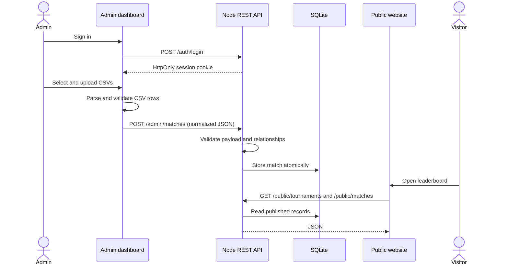

# Architecture

## Components and ownership

| Component | Address | Host | Owner |
| --- | --- | --- | --- |
| Public frontend | `https://strakhovgg.com` | GitHub Pages | Website owner |
| Admin frontend | `https://admin.strakhovgg.com` | Node service | Dev/server team |
| REST API | `https://admin.strakhovgg.com/api/v1` | Same Node service | Dev/server team |
| SQLite database | `/app/data/ffmena.sqlite` in the container volume | Dev/server team | Dev/server team |

## Data flow



## Files and persistence

- Source code lives in GitHub.
- Production secrets live only in the server environment or secret manager.
- Tournament, phase, day, match, and session records live in SQLite.
- Uploaded CSVs are parsed in the admin browser and are not stored as files.
- Logos are resized in the browser and stored as data URLs in SQLite.
- The SQLite database and backups live on persistent server volumes, never in
  the container writable layer or Git repository.

## Why SQLite

The workload is small, relational, and managed by a limited number of admins.
SQLite provides transactions, foreign keys, atomic cascade deletion, indexes,
and one-file backups without operating a separate database server. PostgreSQL
can replace it later behind the repository boundary if write concurrency or
multi-instance deployment becomes necessary.

Run exactly one application replica while using SQLite. Horizontal scaling
requires shared database infrastructure such as PostgreSQL.

## Trust boundaries

- Public visitors can only read published tournament data.
- Admin credentials are checked only by the server.
- Session tokens are random, stored hashed, and delivered in secure HttpOnly
  SameSite cookies.
- Client validation improves usability; server validation is authoritative.
- The API accepts requests only from configured web origins.
- The reverse proxy terminates TLS; the Node process listens on loopback only.

## CSV data contract

Teams require:

```text
Team Name, Kill, Total Score, Survival Score, Damage, BOOYAH!, Match Rank
```

Players require:

```text
Player Name, Team Name, Kill, Damage, Assist, Knock Down, Headshots
```

Names are 1-100 characters. Statistics are non-negative whole numbers. A CSV is
limited to 2 MB and 5,000 rows in the browser; the API independently limits
request bodies to 8 MB and validates every submitted row.
